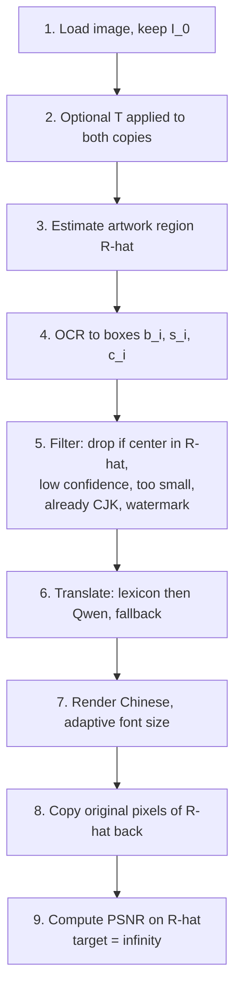
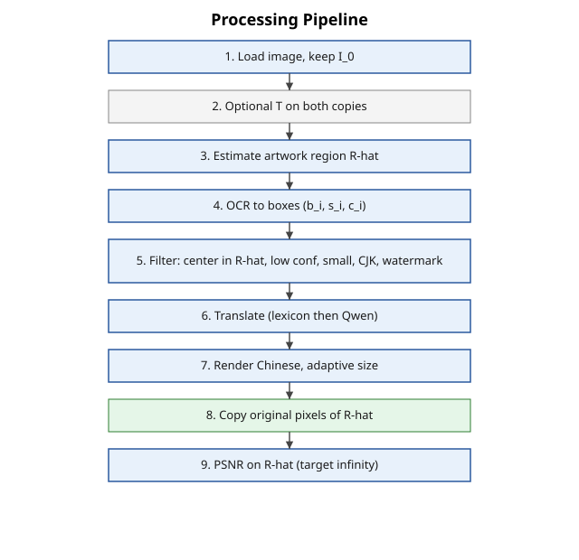

# Processing Pipeline

```mermaid
flowchart TD
    S1[1. Load image, keep I_0] --> S2[2. Optional T applied to both copies]
    S2 --> S3[3. Estimate artwork region R-hat]
    S3 --> S4[4. OCR to boxes b_i, s_i, c_i]
    S4 --> S5[5. Filter: drop if center in R-hat,<br/>low confidence, too small,<br/>already CJK, watermark]
    S5 --> S6[6. Translate: lexicon then Qwen, fallback]
    S6 --> S7[7. Render Chinese, adaptive font size]
    S7 --> S8[8. Copy original pixels of R-hat back]
    S8 --> S9[9. Compute PSNR on R-hat<br/>target = infinity]
```

Step 8 is the hard constraint.  
Step 9 is measured before any debug overlay is drawn.
